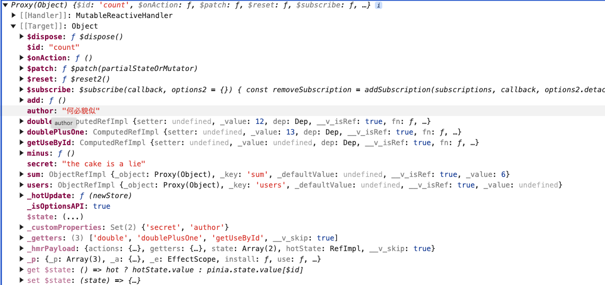

# vue3 相比vue2 的区别

## 性能提升

- 打包大小减少了`41%`
- 初次渲染快`55%`，更新渲染快`133%`
- 内存减少`54%`

## 源码升级

- 使用`proxy` 代替`defineProperty`实现响应式
  *vue2,对于对象属性的添加或删除，可能需要使用vue.set或者vue.delete，因为Object.defineProperty无法检测到这些变化。而Proxy可以监听整个对象。*
- 重新虚拟`DOM`的实现和`Tree-Shaking`

## 拥抱TypeScript

- `vue3` 可以更好的支持`TypeScript`

## 新的特性

- Composition API（组合API）
  *vue2用的是选项式API，如data，methods，computed这些分开写。vue3引入了setup函数，还有ref、reactive这些函数，可以让代码按功能组织，而不是分散在各个选项里。这样逻辑复用更方便。如用Composition API 写hook，类似React的Hooks*
  - setup
  - ref和reactive
  - computed于watch

- 新的内置组件
  - Fragment
  - Teleport
  - Suspense

- 其他改变
  - 新的生命周期钩子
  - data选项应始终被声明为一个函数
  - 移除keyCode支持作为 v—on的修饰符

---

## Vue 3 和 Vue 2 的主要区别可以从以下几个方面进行总结

### 响应式系统

- Vue 2：使用 Object.defineProperty 实现响应式，无法检测对象属性的添加/删除，需通过 Vue.set 或 Vue.delete 操作。

- Vue 3：基于 Proxy 重构响应式系统，支持动态属性增删、数组索引修改等场景，性能更高且无需额外 API。

---

### 组合式 API（Composition API）

- Vue 2：采用选项式 API（data, methods, computed 等），逻辑分散在不同选项中。

- Vue 3：引入组合式 API（setup 函数 + ref/reactive），允许按功能组织代码，提升逻辑复用性（类似 React Hooks）。

---

### 性能优化

- 虚拟 DOM 优化：

  - 静态节点提升（静态内容跳过 diff 比较）。

  - 编译时标记动态节点（patchFlag），减少运行时比对。

- Tree-shaking 支持：按需引入模块，减小打包体积（Vue 3 仅打包被使用的功能）。

- 响应式系统优化：依赖追踪更高效，内存占用更低。

---

### 生命周期钩子

- Vue 3：

  - beforeCreate 和 created 被 setup 替代。

  - 其他钩子名添加 on 前缀（如 onMounted、onUpdated）。

  - 新增 onRenderTracked 和 onRenderTriggered 用于调试。

---

### 模板特性

- 多根节点支持：Vue 3 支持模板中多个根元素（无需包裹 <div>）。

- v-model 改进：

  - 支持多个 v-model（如 v-model:title）。

  - 默认使用 modelValue 和 update:modelValue 替代 value 和 input。

- key 使用调整：v-if/v-else 不再强制要求 key。

---

### TypeScript 支持

- Vue 3：使用 TypeScript 重写，提供更好的类型推断和开发体验。

- Vue 2：需借助 vue-class-component 或 vue-property-decorator 实现类型支持。

---

### 新组件与 API

- Teleport：将组件渲染到 DOM 任意位置（类似 React Portal）。

- Suspense：处理异步组件加载状态（如加载中、错误）。

- Fragment：支持多根节点组件。

- 自定义渲染器：允许渲染到非 DOM 环境（如 Canvas、Native）。

---

### 全局 API 调整

- Vue 3：通过 createApp 创建实例，避免全局配置污染（如 Vue.use 改为 app.use）。

- 移除部分 API：如 $on、$off（事件总线模式被废弃），推荐使用 mitt 等库替代。

---

### 其他变化

- 过滤器（Filter）移除：建议用计算属性或方法替代。

- 事件监听：支持绑定多个同名事件（Vue 2 会覆盖）。

- 构建工具：推荐使用 Vite（基于原生 ES 模块，启动更快）。

---

### 总结

- 性能：更高效的响应式系统、虚拟 DOM 优化、Tree-shaking。

- 开发体验：组合式 API 提升代码组织、TypeScript 原生支持。

- 灵活性：Fragment、Teleport、自定义渲染器等新特性。

- 兼容性：Vue 3 支持大多数 Vue 2 特性，但部分 API 需调整。

**Vue 3 在性能、代码组织和可维护性上均有显著提升，适合新项目或对复杂场景有更高要求的应用。**

---

## vite

vite是新一代的前端构建工具，

优势：

- 轻量快速的热重载（HMR），能实现极速的服务启动
- 对Typescript、JSX、 CSS 等支持开箱即用
  *webpack需要对应的loader，webpack 只能处理js文件，*
- 真正的按需编译，不再等待整个应用编译完成

---

## webpack 和 vite 区别

### 设计理念

- webpack：
  - 是一个大包工具，专注于将项目中的所有资源（javascript css 图片等）打包成一个或多个文件
  - 采用`基于依赖图的打包方式`，通过解析模块依赖关系，生成最终的打包文件
  - 设计初衷是为了解决复杂项目的模块化问题，支持丰富的插架和加载器
- vite：
  - 是一个开发服务器 + 构建工具，专注于提升开发体验和构建效率
  - 采用`基于原生ES模块的开发模式`，利用现代浏览器的原生模块加载能力，实现快速的开发服务器启动和热更新
  - 设计初衷是为了解决Webpack在大型项目中开发启动慢，热更新慢点问题

### 性能

- webpack：
  - 开发模式： 启动较慢，因为需要先构建整个项目的依赖图
  - 热更新： 热更新速度较慢，尤其是大型项目
  - 生产模式： 打包优化成熟，支持代码分割，Tree-Shaking等高级功能

- vite：
  - 开发模式： 启动较快，因为直接利用浏览器的ES模块加载能力，无需预先打包
  - 热更新： 热更新速度快，只更新修改的部分
  - 生产模式： 使用Rollup进行打包，打包效率高，但生态和插架相对webpack较少

### 开发体验

- webpack：
  - 配置复杂，尤其是大型项目，需要手动配置加载器，插架等
  - 开发体验较为传统，启动和热更新速度较慢

- vite：
  - 配置简单，开箱即用，适合现代前端框架（vue3， React）
  - 开发体验极佳，启动和热更新速度快，支持按需加载

### 生态和插架

- webpack：
  - 生态极其丰富，支持大量插架和加载器，适用于各种复杂场景
  - 社区成熟，文档和教程丰富
- vite：
  - 生态相对较新，但发展迅速，支持主流框架（vue，React svelte）
  - 插架和工具链相对较少，但足以满足大多数现代前端开发需求。

### 适用场景

- webpack：
  - 适合`复杂的大型项目`,尤其是需要高度定制化打包流程的场景
  - 适合需要兼容旧版浏览器的项目
- vite：
  - 适合`现代前端项目`，尤其是追求开发效率和体验的场景
  - 适合使用Vue3、React等现代框架的项目

### 优缺点对比

|特性|Webpack|Vite｜
|---|---|---|
|启动速度|慢（需构建依赖图）|快（基于ES模块）|
|热更新速度|慢（需重新构建）|快（按需更新）|
|配置复杂度|复杂（虚手动配置）|简单（开箱即用）|
|生态和插架|丰富（插架和加载器多）|较少（但发展迅速）|
|生产打包|成熟（支持代码分割，Tree Shaking）|高效（基于Rollup）|
|使用场景|复杂大型项目、兼容旧浏览器|现代前端项目、追求开发效率 |

### 总结

- webpack是一个成熟且功能强大的打包工具，适合复杂项目和需要高度定制的场景，但开发体验较慢
- vite是一个现代化的开发工具，专注于提升开发效率和体验，适合现代前端项目，但在生态和插架方面相对较弱

**如果需要兼容旧浏览器或处理复杂项目是，选择webpack**
**如果追求开发效率和现代化前端开发体验，选择vite**

## ref 和reactive

1. 数据类型

- ref
    适用于基本类型（string number boolean），可以用于对象和数组。当传递对象和数组时，内部会自动调用`reactive`进行深层响应式转换
- reactive
  仅适用于对象类型（对象 数组 集合类型Map Set），对基本类型无效

2.访问方式

- ref
  通过`.value`访问或修改值（模版中自动解包，无需`.value`）

- reactive
  直接访问属性

3.重新赋值

- ref
  允许直接替换整个对象，保持响应性

- reactive
  重新赋值会失去响应性（本质是Proxy代理原始对象，而非变量本身）

4.解构响应性

- ref
  解构时需要保持对`.value`的引用，否则失去响应性

  ```js
  const state = ref({a:1})
  const a = state.value.a // 普通值，无响应性
  ```

- reactive
  解构需用`toRefs`维持响应性

  ```js
  const state = reactive({a:1})
  const {a} = toRefs(state)
  ```

5.使用场景

- ref 适用场景
  - 基本类型数据
  - 需要替换整个对象/数组的响应式变量（如接口返回的数据替换）
  - 组合函数中返回响应式变量，便于解构使用
  
  ```js
  // usePerson.js
  export function usePerson() {
    const personRef = ref({
      name: "Alice",
      age: 11
    })
    const updatePerson = (name, age) => {
      personRef.value.name = name
      personRef.value.age = age
    }

    return {
      person: personRef
      updatePerson
    }
  }
  ```

  ```jsx
  // vue
  <template>
    <div>
      <p>Name: {{ person.name }}</p>
      <p>Age: {{ person.age }}</p>
      <button @click="updatePerson('Bob', 30)">Change Person</button>
    </div>
  </template>

  <script>
  import { usePerson } from "./usePerson"

  export default {
    setup() {
      const {person, updatePerson} = userPerson()
      return {
        person,
        updatePerson
      }
    }
  }
  <script>
  ```

- reactive 适用场景
  - 复杂的嵌套对象或需保持引用一致的数据结构
  - 无需重新赋值，仅需修改属性的对象

6.TypeScript类型推断

- ref
  自动推断包裹类型， 如`Ref<number>`
- reactive
  更精准推断对象属性类型，适合复杂的结构

|特性|ref|reactive|
|---|---|---|
|数据类型|基本类型+对象/数组|仅对象/数组|
|访问方式|.value (模版自动解包）|直接访问属性|
|重新赋值|支持（通过.value替换）|不支持（需保持对象引用一致）|
|解构响应性|需保持.value引用|需toRefs转换|
|适用场景|基本类型、需替换整体的数据|复杂对象、无需重新赋值的解构|

## 计算属性

计算属性是一种`基于响应式依赖进行缓存的属性`。它们会根据依赖的响应式数据自动更新，并且只有在依赖发生变化时才会重新计算。计算属性非常适合用于处理复杂的逻辑或需要频繁计算的场景

**总结**
计算属性是基于响应式依赖进行缓存的属性。

计算属性可以通过 computed 函数定义，并且可以是只读的或可写的。

计算属性适合用于处理复杂的逻辑或需要频繁计算的场景。

计算属性和方法的主要区别在于缓存机制，计算属性会缓存结果，而方法每次调用都会执行。

## watch

- 基本用法

  1. 监听ref定义的响应式数据

  *直接传入ref变量，可获取新旧值*

  ```js
  import {ref, watch} form 'vue'
  const count = ref(0)
  watch(count, (newVal, oldVal) => {
    console.log(`新值：${newVal}, 旧值：${oldVal}`)
  })
  ```

  2. 监听reactive定义的响应式数据

    *默认强制开启深度监听，但无法正确获取旧值（oldVal与newVal相同）*

    ```js
    const state = reactive({count:0})
    watch(state,(newVal, oldVal)=> {
      console.log(`新值：`, newVal.count)
    })
    ```

- 进阶配置

  1. 监听对象中的特定属性

  *使用函数式参数监听reactive对象的某个属性，可获取新旧值*

  ```js
  watch(() => state.count, (newVal, oldVal) => {
    console.log(`新值：${newVal}, 旧值：${oldVal}`)
  })
  ```

  2. 监听多个数据源

  *使用数组形式监听多个数据，参数按顺序对应*

  ```js
  watch([count, () => state.name], ([newCount, newName], [oldCount, oldName]) => {
    console.log('多个数据变化'， newCount, newName)
  })
  ```

  *任一数据变化都会触发回调*
  3. 配置选项

  - `deep：true`：深度监听对象内部变化（对ref对象有效）
  - `immediate: true`：立即执行回调（初始值触发）
  - `flush: 'post'`： DOM更新后执行回调（避免操作未渲染的DOM）

  ```js
  watch(sourc, callback, { deep: true, immediate: true, flush: 'post'})
  ```

- 特殊场景与注意事项

  1. 停止监听

  *watch返回一个停止函数，调用即可终止监听*

  ```js
  const stop = watch(count, callback)
  stop()
  ```

  2. watch与watchEffect的区别

  - `watch`： 需显式指定监听源，可获取新旧值，适合精确控制
  - `watchEffect`：自动追踪依赖，无新旧值，适合依赖多个数据的副作用

  ```js
  watchEffect(() => {
    console.log('自动追踪：', count.value, state.name)
  })
  ```

  3. 监听ref的深拷贝对象

  *若需获取引用类型数据的旧值，可监听其深拷贝*

  ```js
  const obj = ref({a:1})
  watch(()=> ({...obj.value}), (newVal, oldVal) => {
    console.log('新旧值不同：', newVal, oldVal)
  }, {deep: true})
  ```

- 常见问题

  1. reactive对象无法获取旧值
  *Vue3的响应式系统导致`oldVal`与`newVal`指向同一代理对象，需通过函数式监听属性或深拷贝解决*
  2. 深度监听无效
  *`reactive`对象默认深度监听，`deep`配置对其无效*

**Vue 3 的 watch 提供了灵活的数据监听能力，适用于不同响应式数据类型（ref/reactive）和复杂场景（多数据源、深度监听）。合理使用配置选项（如 immediate、flush）可优化性能与行为。若需简化依赖追踪，可结合 watchEffect 使用**

---

## watchEffect

立即运行一个函数，同时响应式地追踪其依赖，并在依赖更改时重新执行该函数

watchEffect不用明确指出监视的数据（函数中用到了哪些属性，就监听哪些属性）

---

## 标签的ref属性

用于注册模版引用

- 用在普通`DOM`标签上，获取的是`DOM`节点
- 用在组件标签上，获取的是组件的实例对象

## 路由

### 路由器工作模式

- history模式
  - 优点：URL更加美观，不带有#，更接近传统的网站URL
  - 缺点：后期项目上线，需要服务端配合处理路径问题，否则刷新会有404错误
  
  ```js
    const router = createRouter({
      history: createWebHistory()
      /**** */
    })
  ```

- hash模式
  - 优点：兼容性更好，因为不需要服务器端处理路径
  - 缺点：URL带有#不太美观，且在SEO优化方面相对较差

  ```js
    const router = createRouter({
      history: createWebHashHistory()
    })
  ```

```nginx
server{
  listen 80;
  server_name localhost;
  root /root/gshop;

  localtion / {
    root /root/gshop;
    index index.html;
    try_files $uri $uri/ /index.html;
    autoindex off； # 禁止目录列表
  }
}
```

**`try_files $uri $uri/ /index.html;`：这行代码的作用**

在单页面应用（SPA），所有的路由都是由前端处理，服务器只需返回一个index.html。这个时候，当用户访问一个路径`/dashboard`时，服务器需要先检查是否存在`/dashboard`这个文件，如果不存在，再检查是否存在`/dashboard/`目录，如果都不存在，则返回`/index.html`,由前端处理。

**`autoindex off`：这行代码的作用**
若目录存在但无默认文件，可能导致列出目录内容。这行代码是关闭目录索引。

## pinia

**pinia 和Vuex 的区别**

- 相同点：

`pinia`和 `Vuex`, 都是Vue的状态管理库。
他俩都是用来管理全局状态的。适用于组件间共享数据。

- 不同点：
vuex有State、Mutations、Action、Getters
pinia更简化，使用Store定义，没有Mutations，直接通过Actions处理同步和异步操作

Vuex的模块系统需要嵌套，而Pinia支持扁平化的模块，每个store独立，可能更容易组织代码。pinia对TypeScript的支持更好，不需要复杂的包装，使用起来更直观

- Vuex
  - 定位： Vue2的官方状态管理库，适用于中大型项目
  - 核心概念：
    - **state**：存储数据的唯一源头
    - **Mutations**：唯一修改`state`的方法（同步操作）
    - **Actions**： 处理异步操作，提交`mutations`
    - **Getters**： 计算属性，派生`state`值
    - **Modules**：将Store分割成模块（但模块嵌套可能复杂）
- Pinia
  - 定位：Vue3官方推荐的状态管理库，替代Vuex。更简洁、轻量，且天然支持TypeScript
  - 核心特点：
    - **无`mutations`**：直接通过`actions`处理同步/异步操作
    - **扁平化模块**：每个Store独立，无需嵌套模块
    - **Typescript友好**：自动推导类型，无需额外配置
    - **Composition API 风格**：与Vue3的响应式系统更契合

### 定义一个Store

`Store`是使用`defineStore()`定义的，并且它需要一个**唯一**名称，作为第一个参数传递，也称为id，它是必要的。Pinia使用它来将store连接到devtools。
将返回到函数命名为use... 是跨可组合项的约定，以使其符合你的使用习惯。

```ts
import { defineStore } from "pinia";

const useCountStore = defineStore('count', {
  // 存储数据的地方
  state() {
    return {
      sum: 6
    }
  },

  actions: {
    add() {
      this.sum++
    },
    minus() {
      this.sum--
    }
  }
})

export default useCountStore
```

**`store`是一个用`reactive`包裹的对象，这意味着不需要在`getter`之后写`.value`,但是就想在setup中的props一样，不能对其进行解构。
为了从`Store`中提取属性同时保持其响应式，需要使用`storeToRefs()`。它将为任何响应式属性创建refs。仅在使用store中的状态但不调用任何操作时，很有用**

### State

state是store的核心部分。通常从定义应用程序的状态开始。在pinia中，状态被定义为返回初始状态的函数。

#### 访问 `state`

默认情况下，可以通过`store`实例访问状态来直接读取和写入状态：

  ```js
  const store = useStore()

  store.sum++
  ```

#### 重置状态

可以通过调用store上的`$reset()`方法将状态 重置 到其初始值：

  ```js
  const store = useStore()
  store.$reset()
  ```

- 使用选项API

  ```js
  import { defineStore } from 'pinia'

  const useCounterStore = defineStore('counteerStore', {
    state:() => {
      return [
        counter: 0
      ]
    }
  })
  ```

- 使用 `setup()`

  ```js
  import { useCounterStore } from "./store/counterStore"

  export default {
    setup() {
      const counterStore = useCounterStore()

      return { counterStore }
    }
    computed: {
      tripleCounter() {
        return counterStore.counter * 3
      }
    }
  }
  ```

- 不使用`setup()`
不使用`setup()`，则可以使用`mapState()`帮助器将状态属性映射为只读计算属性

  ```js
  import { mapState } from 'pinia'
  import { useCounterStore } from '../store/counterStore'

  export default {
    computed: {
      ...mapState(useCounterStore, {
        myOwnName: 'counter',
        double: store => store.counter * 2
        magicValue(store) {
          return store.someGetter + this.counter + this.double
        }
      })
    }
  }
  ```

#### 订阅状态($subscribe)

可以通过store的`$subscribe()`方法查看状态及其变化。与常规的`watch()`相比，使用`$subscribe()`的优点是 subscriptions只会在patches之后触发一次。

默认情况下，state subscriptions绑定到添加它们的组件。当组件被卸载时，它们将被自动删除。如果要在卸载组件后保留它们，需要 `{ detached: true }` 作为第二个参数传递给 detach 当前组件的state subsctiption

```js
countStore.$subscribe((mutation, state) => {
  
  mutation.type  // direct patch object patch fucntion
  mutation.storeId // countStore.$id  count
  mutation.payload // 仅当 mutation.type === ‘patch object' 时， 补丁对象传递给 countStore.$patch()
})
```

例子：

```js
const countStore = useCountStore()

console.log(countStore.sum)

countStore.$subscribe((mutation, state) => {
  console.log('countStore发生变化了')
  console.log(mutation)
  console.log(state)
})

/**
 * 直接修改
 */
function add(){
  countStore.add()
}

function minus() {
  countStore.minus()
}

/**
 * 使用$patch修改
 * 
 * 对象修改
 */
function patchObject() {
  countStore.$patch({
    sum: countStore.sum *3
  })
}

/**
 * 使用$patch修改
 * 
 * 函数修改
 */
function patchFunction(){
  countStore.$patch((state) => {
    state.sum = state.sum * 10
  })
}
```


### Getters

Getter 完全等同于Store状态的计算值。它们可以用`defineStore()`中的`getters`属性定义。它们接受“状态”作为第一个参数以鼓励箭头函数的使用：

```js
const useCountStore = defineStore('count', {
  // 存储数据的地方
  state() {
    return {
      sum: 6
    }
  },
  getters:{
    double:(state) => state.sum * 2,

    /**
     * 由于“doublePlusOne'”不具有返回类型批注并且在它的一个返回表达式中得到直*接或间接引用，因此它隐式具有返回类型 "any"。
     */
    doublePlusOne() {
      return this.sum * 2 + 1
    }

    /**
     * 
     * 在使用常规函数通过this访问整个store的实例时，需要定义返回类型。
     * 这是由于TypeScript中的一个已知限制，
     * 使用箭头函数定义的getter，和不使用this的getter 不会受此影响
     * 
     */

    doublePlusOne():number {
      return this.sum * 2 + 1
    }

  },
})
```

可以直接在store实例上访问getter：

```html
<p>{{ countStore.double }}</p>
<p>{{ countStore.doublePlusOne }}</p>
```

#### 访问其他getter

与计算属性一样，可以组合多个getter。通过`this`访问任何其他getter。即使不使用TypeScript，可以使用JSDoc提示IDE类型：

```js
const useCountStore = defineStore('count', {
  // 存储数据的地方
  state() {
    return {
      sum: 6
    }
  },
  getters: {
    // 不使用this，它的类型时自动推断的
    double: (state) => state.sum * 2,

    // 1 使用ts
    doublePlusOne(): number {
      return this.double + 1
    },

    // 2. 使用JSDoc
    /**
     * @returns { number }
     */
    doublePlusTow() {
      return this.double + 1
    }

  },
})
```

#### 将参数传递给getter

Getters只是幕后的computed属性，故无法向它们传递任何参数。但是，可以从getter返回一个函数以接受任何参数：

```js
interface User {
  id: number
  name: string
  age: number
}

const useCountStore = defineStore('count', {
  // 存储数据的地方
  state() {
    return {
      sum: 6,
      users: [
        { id: 1, name: 'Alice', age: 25 },
        { id: 2, name: 'Bob', age: 30 },
        { id: 3, name: 'Charlie', age: 28 }
      ] as User[]
    }
  },
  getters: {
    getUseById:(state) => {
      return (userId:number) => state.users.find(user => user.id === userId)
    }
  },
})


```

#### 访问其他Store的getter

要使用其他存储getter，可以直接贼getter内部使用它

#### 与`setup()` 一起使用

可以直接访问任何getter作为store的属性（与state属性完全一样）

#### 使用选项API

- 使用`setup()`
虽然CompositionAPI并不适合所有人，但`setup()`钩子可以使在Options API 中使用Pinia更容易。不需要额外的map helpers 功能

- 没有`setup()`
可以使用 previous section of state 中使用的相同`mapState()`函数映射到getter：

### Actions

Actions相当于组件中的`methods`。它们可以使用`defineStore()`中的`actions`属性定义，并且它们非常适合定义业务逻辑：

```js
const useCountStore = defineStore('count', {
  // 存储数据的地方
  state() {
    return {
      sum: 6
    }
  },
  actions: {
    add() {
      this.sum++
    },
    minus() {
      this.sum--
    }
  }
})
```

与getters一样，操作可以通过`this`访问 *whole store instance*  并提供完整类型（和自动完成）支持。与它们不同，`actions`可以使异步的，可以在其中`await`任何API调用甚至其他操作。

```js
export const useUsers = defineStore('users', {
  state: () => ({userData: null}),
  actions: {
    async registerUser(login, password) {
      try {
        this.userData = await fetch(xxx)
      } catch(error) {
        showTootip(error) 
        return error
      }
    }
  }
})
```

#### 访问其他store操作

要使用另一个store，可以直接在操作内部使用它：

#### 订阅 Actions

可以使用`store.$onAction()`订阅action及其结果。传递给它的回调在action之前执行。`after`处理Promise并允许你在action完成后执行函数。以类似的方式，`onError`允许你在处理中抛出错误。这些对于在运行时跟踪错误很有用，类似于vue文档中的这个提示。

```js
countStore.$onAction(({
  name,
  store,
  args,
  after,
  onError
}) => {
  const startTime = Date.now()
  console.log(`Start "${name}" with params [${args.join(', ')}]`)
  after((result) => {
    console.log(
      `Finished "${name}" after ${Date.now() - startTime}ms.\nResult:${result}.`
    )
  })
  onError((error) => {
    console.warn(`Failed "${name}" after ${Date.now() - startTime}ms.\nError:${error}.`)
  })
})
```


默认情况，action subscriptions 绑定到添加它们的组件（如果store位于组件的`setup()`内)。意思是，当组件被卸载时，它们将被自动删除。如果要在卸载组件后保留它们，请将`true`作为第二个参数传递给当前组件的detach action subscription

### plugin

由于是底层API，pinia store 可以完全扩展。

- 向Store添加属性
- 定义Store时添加新选项
- 为Store添加新方法
- 包装现有方法
- 更改甚至取消操作
- 实现本地存储等副作用
- 仅适用于特定的Store

使用`pinia.use()`将插架添加到pinia实例中。

```js
function SecretPiniaPligin() {
  return { secret: 'the cake is a lie'}
}

pinia.use(SecretPiniaPligin)
```

这对于添加全局对象（路由器、模式或者toast管理器）很有用

#### 介绍

Pinia插架是一个函数，可以选择返回要添加到store到属性。它需要一个可选参数，一个context：

```js
export function myPiniaPlugin(context) {
  context.pinia
  context.app
  context.store
  context.options
}
```

```js

function SecretPiniaPligin(context: PiniaPluginContext) {
  console.log(context)
  return { secret: 'the cake is a lie' }
}

pinia.use(SecretPiniaPligin)
```


### 为所有组件创建公共属性（扩充store）

- 第一种扩充方式

```js
pinia.use(() => {
  return {
    author: '何必貌似'
  }
})

```

- 第二种扩充方式

```js
pinia.use(({ store }) => {
  store.author = '何必貌似'
})
```



每个store都使用`reactive`包装，自动展开任何Ref()，它包含了

```js
const sharedRef = ref('shared')

pinia.use(({ store }) => {
  store.hello = 'world'
  store.withRefHello = ref('world')
  store.shared = sharedRef

  console.log(store.withRefHello)
  console.log(store.shared)

  if (process.env.NODE_ENV === "development") {
    console.log(23423)
    store._customProperties.add('hello')
  }
})
```


### 添加新的外部属性

当添加外部属性、来自其他库的类实例或仅仅是非响应式的东西时，应该在将对象传递给pinia之前使用`markRaw()`包装对象。

```js
import { markRaw } from "vue"

import { router } from "./router"

pinia.use(({store})=>{
  store.router = markRaw(router)
})
```

### 在插架中调用`$subscribe`

```js
pinia.use(({store}) => {
  store.$subscribe(() => {})
  store.$onAction(() => {})
})
```

### 添加新选项

可以在定义store时创建新选项，以便以后从插件中使用它们。

```js
defineStore('search', {
  action: {
    searchContacts() {

    }
  },
  debounce: {
    searchContacts: 300
  }
})
```

## v-model

- 使用`defineModel`宏

  子组件

  ```js
  <template>
    <div>
      <input v-model="m">{{ m }}
    </div>
  </template>

  <script setup lang="ts">
  const m = defineModel()
  </script>
  ```

  父组件

  ```js
  <script setup lang="ts">
  import { ref } from 'vue';
  import MyUi from './MyUi.vue';
  const haha = ref("sj")
  </script>

  <template>
    <MyUi v-model="haha"/>
  </template>
  ```

- 底层机制

  `defineModel`是一个便利宏。编译器将其展开为以下内容：
  
  - 一个名为`modelValue`的prop，本地ref的值与其同步
  - 一个名为`update:modelValue`的事件，当本地ref的值发生变更时触发

  - 子组件

  ```js
  <template>
  <div>
    <input 
    :value="props.modelValue"
    @input="emit('update:modelValue', (<HTMLInputElement>$event.target).value)"
    >
    </div>
  </template>

  <script setup lang="ts">
  const props = defineProps(['modelValue'])
  const emit = defineEmits(['update:modelValue'])
  </script>
  ```

  - 父组件

  ```js
  import MyInput from './MyInput.vue';
  const foo = ref('nihao')
  </template>
      <MyInput :model-value="foo" @update:model-value="$event => (foo = $event)"/>
    </div>
  </template>
  ```

### 透传Attributes

“透传attribute” 指的是传递给一个组件，却没有被该组件声明`props` 或 `emits`的attribute或者`v-on`事件监听器。最常见的例子就是`class`、`style`和`id`

```js
<!--<MyButton>的模版-->
<button>Click Me</button>
```

```js
<MyButton class='large' />
```

渲染后的DOM结果是：

```js
<button class='large'>Click me<button>
```

这里的`<MyButton>`并没有将`class`声明为一个它所接受的prop，所以`class`被视作透传attribute，自动透传到了`<MyButton>`的跟元素上

### $refs

- 概述：
  - $refs用于：**父 -> 子**
  - $parent用于：**zi -> 父**

- 原理：

  |属性|说明
  |---|---
  |$refs|值为对象，包含所有被ref属性标识的DOM元素或组件实例
  |$parent|值为对象，当前组件的父组件实例对象

### provide、 inject

- 概述：实现**祖孙组件**直接通信
- 具体使用：
  - 在祖先组件中通过`provide`配置向后代组件提供数据
  - 在后代组件中通过`inject`配置来声明接收数据

### 插槽

- 默认插槽

```js
<template>
  <div class="ui-parent">
    父
    <children>
      你好 我是来自父组件的内容
    </children>
  </div>
</template>
```

```js
<template>
  <div class="ui-child">
    子
    <slot>默认内容：（当父组件不传递内容时显示）</slot>
  </div>
</template>
```

- 具名插槽

```js
<template>
  <div class="ui-parent">
    父
    <children>
      <template #header>
        <p>header</p>
      </template>
      你好 我是来自父组件的内容
      <template #footer>
        <p>footer</p>
      </template>
    </children>
  </div>
</template>
```

```js
<template>
  <div class="ui-child">
    子
    <slot name="header"></slot>
    <slot>默认内容：（当父组件不传递内容时显示）</slot>
    <slot name="footer"></slot>
  </div>
</template>
```

- 进阶技巧
  - 作用域插槽(数据传递)
  
  *插槽的内容无法访问到子组件的状态*

  在某些场景下插槽的内容可能想要同时使用父组件域内和子组件域内的数据。要做到这一点，需要一种方法来让**子组件在渲染时将一部分数据提供给插槽**

  ```js
  <template>
    <div>
      <slot :text="greetingsMessage"></slot>
    </div>
  </template>

  <script setup lang="ts">
  import { ref, reactive } from 'vue';
  const greetingsMessage = ref('作用于插槽')
  </script>

  <style scoped>

  </style>
  ```

  ```js
  <childrenAttr>
    <template v-slot="params">
      {{ params.text }}
    </template>
  </childrenAttr>
  ```
  